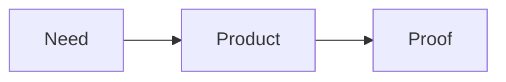

# MindPPT Language v0

Status: draft language contract aligned with the accepted v0 roadmap  
Runtime: Cordis plugins, React + TypeScript host UI, Excalidraw rendering

## 1. Purpose

MindPPT is a spatial presentation language.

A slide is also a mind-map node. One source file describes:

1. slide content;
2. the primary spatial topology between slides;
3. optional cross-links;
4. optional presentation routes.

The source file is the single source of truth.

~~~text
MindPPT source
      |
      v
 code-parser
      |
      v
MindPptStructure
   |          |
   v          v
canvas      camera
   |
   v
Excalidraw
~~~

Excalidraw is a rendering projection. It is not a second authoring model.

## 2. Core language principles

### 2.1 Slide = mind-map node

There is no separate slide entity and mind-map-node entity.

A slide ID is also the ID used by tree edges, soft links, paths, camera targets, diagnostics, and agent edits.

~~~mindppt
tree LR {
  intro --> market
}

slide intro {
  # Introduction
}

slide market {
  # Market
}
~~~

### 2.2 Open Content, Closed Structure

Core owns document structure:

~~~text
deck
slide
tree
link
path
~~~

Third-party plugins may extend slide content, but they must not redefine slide ownership, primary-tree semantics, soft-link semantics, or path semantics.

### 2.3 Unknown Content Is Valid

Missing an optional content plugin must not make a source file invalid.

Unknown extension payload is preserved and shown through a generic fallback.

### 2.4 Capability is not grammar

Loading a plugin such as dsh-mindppt-latex does not change the outer MindPPT grammar.

The core parser recognizes a generic extension block. Runtime plugins may interpret or render that block more richly.

### 2.5 Structure and content use different syntax strengths

MindPPT intentionally uses a hybrid language:

~~~text
topology     -> Mermaid-like graph notation
layout       -> MindPPT DSL
content      -> small Markdown profile
extensions   -> fenced blocks
~~~

The language is neither CommonMark-compatible nor Mermaid-compatible as a whole.

## 3. File shape

A document starts with:

~~~mindppt
mindppt
~~~

A normal source file may then contain:

~~~mindppt
mindppt

deck {
  ...
}

tree LR {
  ...
}

link ...

slide ...
slide ...

path ...
~~~

Declaration order does not determine semantic ownership. References are resolved after the whole document is parsed.

## 4. Structural lexical rules

MindPPT is not indentation-sensitive at the structural level.

Multi-line structural declarations use braces.

~~~mindppt
tree LR {
  intro --> market
  market --> product
}
~~~

Identifiers:

- use ASCII letters, digits, underscore, and hyphen;
- cannot begin with a digit;
- are case-sensitive in v0.

Strings use double quotes where the DSL needs a scalar string.

Arrays use square brackets where structured data requires them.

Newlines separate statements. Semicolons are not required.

Line comments may use // outside Markdown content and fenced blocks.

## 5. Hybrid parsing boundary

Inside a slide or layout slot, Markdown is the default content interpretation.

Known MindPPT structural, layout, and core structured-content constructs are recognized only at block-start positions outside fenced blocks. In v0 this includes constructs such as slide/tree/path, layout slots, table, and chart. Other slide-body text defaults to the Markdown profile.

A structural closing brace ends a slide/layout block only when it appears as the structural closing line outside a fence.

This means content such as the following must remain opaque to the outer parser:

~~~~markdown
```latex
f(x) = \{x \mid x > 0\}
```
~~~~

and:

~~~~markdown
```text
A --> B
```
~~~~

The outer parser must not interpret those braces or arrows as MindPPT structure.

## 6. Deck

The deck block defines presentation-wide defaults.

Target v0 shape:

~~~mindppt
deck {
  size 16:9
  theme "default"
}
~~~

Initial fields:

- size: 16:9 or 4:3;
- theme: a logical theme identifier.

Detailed typography and palette authoring are not part of v0.

## 7. Tree

The tree is the canonical hierarchy and spatial skeleton.

~~~mindppt
tree LR {
  intro --> market
  market --> size
  market --> customer
  market --> competitor
}
~~~

Direction values:

- LR;
- RL;
- TB;
- TD as an alias of TB;
- BT.

The direction is a spatial-layout hint, not a presentation sequence.

### 7.1 Tree invariants

The compiler diagnoses:

- duplicate slide IDs;
- unknown slide references;
- duplicate primary edges;
- multiple parents;
- cycles.

Slides may exist outside the tree. Unreachable slides produce a warning rather than a syntax error.

## 8. Soft links

Soft links are directed cross-branch semantic relationships owned by the core document structure.

~~~mindppt
link competitor -.-> summary
~~~

For M8:

- the source and target must each resolve to an existing slide;
- the relation has stable deterministic semantic identity and a usable source range;
- an identical duplicate source -> target relation is invalid;
- the reverse target -> source relation is a separate valid relation;
- soft links do not change primary-tree parent ownership;
- soft links do not participate in primary-tree spatial layout;
- renderer lowering may show them as a relation visually distinct from primary-tree edges without moving slides.

Following a soft link is navigation to its target slide. It reuses the existing Camera slide-focus request and M5 geometry-based choreography; it does not create a soft-link-specific animation family.

Soft links do not establish a generic graph model. The dotted-arrow spelling remains intentionally Mermaid-like.

## 9. Slide

A slide declaration creates both a presentation page and a mind-map node.

~~~mindppt
slide market {
  # A growing premium segment

  Demand remains seasonal.
}
~~~

Each slide has a globally unique ID.

The ID is shared by tree edges, links, paths, camera targets, diagnostics, and source mapping.

## 10. MindPPT Markdown Profile

Ordinary slide content uses a deliberately small Markdown profile.

The initial v0 target includes only presentation-relevant blocks.

### 10.1 Heading

~~~markdown
# German Outdoor Market
~~~

A level-one heading maps to a title semantic node.

### 10.2 Subtitle

~~~markdown
## 2026 opportunity review
~~~

A level-two heading maps to a subtitle semantic node.

### 10.3 Paragraph

~~~markdown
Demand remains seasonal.
~~~

A paragraph maps to a text semantic node.

### 10.4 Lists

~~~markdown
- Premium products gain share
- Online channels continue growing
~~~

and:

~~~markdown
1. First point
2. Second point
~~~

Lists remain semantic list nodes until layout and rendering.

### 10.5 Images

Target v0 form:

~~~markdown

~~~

The default fit policy may be contain.

Advanced placement or fit belongs to MindPPT layout/component metadata rather than custom Markdown syntax.

### 10.6 Explicitly deferred Markdown features

The v0 Markdown profile does not require:

- full CommonMark compatibility;
- arbitrary HTML;
- blockquotes;
- reference links;
- complex nested lists;
- Markdown tables;
- mixed inline rich-text layout.

Additional Markdown features should be added only when a presentation use case requires them.

## 11. Extension blocks

Triple-backtick fenced blocks are the canonical v0 content-extension envelope.

~~~~markdown
```latex
e^{i\pi} + 1 = 0
```
~~~~

The core parser preserves an extension node conceptually like:

~~~ts
interface ExtensionNode {
  kind: 'extension'
  type: string
  raw: string
}
~~~

Without a matching plugin:

~~~text
ExtensionNode
  -> generic raw text/code fallback
~~~

With a matching plugin:

~~~text
ExtensionNode
  -> Cordis extension capability
  -> optional semantic transform
  -> renderer
  -> Excalidraw-compatible output
~~~

Raw content must never be discarded.

A plugin conflict is a runtime capability error. Multiple plugins must not silently compete for the same extension type.

## 12. Layout DSL

Markdown expresses content. MindPPT DSL expresses presentation layout.

### 12.1 Presets

Initial planned presets:

- hero;
- title-content;
- two-column.

Example:

~~~mindppt
slide customer {
  layout two-column

  left {
    # Customer

    - Younger outdoor users
    - Comfort-sensitive buyers
  }

  right {
    
  }
}
~~~

The exact long-term slot syntax remains provisional.

### 12.2 Layout is content-agnostic

Layout acts on content boxes.

It must not need to understand whether a child is text, image, chart, LaTeX, Mermaid, or another extension.

### 12.3 Advanced layout

Row, column, grid, stack, absolute positioning, and explicit geometry remain valid future directions, but they are not required before a concrete milestone needs them.

## 13. Assets

Local assets are resolved relative to the MindPPT document.

The runtime is responsible for loading those assets into the representation required by Excalidraw.

Remote URL behavior is runtime policy, not a language guarantee.

Stable asset identity should be preserved across recompiles where practical.

## 14. Tables

Tables are core structured presentation content rather than Markdown tables.

Target shape:

~~~mindppt
table comparison {
  columns ["Segment", "Typical position", "Opportunity"]
  row ["Entry", "Price-led", "Low"]
  row ["Mid", "Feature-led", "Medium"]
  row ["Premium", "Comfort-led", "High"]
}
~~~

A table remains semantic in MindPptStructure until renderer lowering.

Initial support:

- header row;
- row data;
- string and numeric cells;
- equal-width columns;
- theme-level basic styling.

Deferred:

- formulas;
- merged cells;
- nested tables;
- spreadsheet editing;
- arbitrary per-cell rich formatting.

## 15. Charts

Charts are core structured presentation content.

Target shape:

~~~mindppt
chart growth {
  type bar
  labels ["2024", "2025", "2026"]
  series "Market" [100, 116, 137]
}
~~~

Initial v0 chart families:

- bar;
- line;
- radar.

A chart remains semantic in MindPptStructure until renderer lowering.

Deferred:

- pie;
- scatter;
- waterfall;
- funnel;
- combo charts;
- secondary axes;
- embedded workbook compatibility.

## 16. Mermaid as slide content

Mermaid-like graph notation for the primary tree remains part of Core.

Mermaid diagrams inside slides are not a special Core grammar.

They use the generic extension envelope:

~~~~markdown

~~~~

Without a Mermaid content plugin, the source remains visible through fallback.

A future dsh-mindppt-mermaid plugin may lower supported Mermaid content to Excalidraw-compatible output.

## 17. Path

A path is named core document structure that defines an ordered presentation route through the spatial document.

~~~mindppt
path main {
  intro
  market
  size
  market
  customer
  product
  summary
}
~~~

Another path may reuse the same slides:

~~~mindppt
path short {
  intro
  market
  summary
}
~~~

For M8:

- the path name / semantic ID is unique;
- a path is non-empty;
- each entry is one ordered slide occurrence and must resolve to an existing slide;
- repeated slide IDs are valid because occurrences, not unique slide IDs, define route position;
- multiple paths may coexist;
- paths have stable deterministic semantic identity and usable source ranges for the declaration and occurrences;
- a step may follow a primary-tree edge, a soft link, or an arbitrary jump;
- no adjacency or cycle validation is performed.

A path is playback ordering only. It does not modify primary-tree ownership or world geometry and is not rendered as another topology edge set.

## 18. Camera semantics

M8 extends the existing Camera service rather than introducing a route/path service.

Camera continues to own transient semantic navigation state and emit slide-focus requests. The React / Excalidraw host continues to own the existing M5 geometry-based viewport choreography.

Active path playback minimally tracks:

~~~text
selectedPathId
currentPathOccurrenceIndex
currentSlideId
~~~

The occurrence index is the authoritative route cursor. Camera must not infer path position from currentSlideId because the same slide may occur more than once in a path.

Minimum path playback behavior:

- selecting a path focuses its first occurrence;
- next advances to the next occurrence when one exists;
- previous moves to the previous occurrence when one exists;
- repeated same-slide occurrences remain distinct path steps;
- focusing any path occurrence reuses the existing Camera focus request and M5 choreography.

Direct focus, parent/child navigation, and following a soft link are non-path navigation. Each exits active path playback context instead of trying to reconcile a cursor.

Compile failure keeps the last-good structure and current Camera/path state. After a successful recompile, active path playback is preserved only when the selected path still exists, the current occurrence index remains in range, and that exact occurrence still resolves to currentSlideId. Otherwise Camera clears the path playback context; ordinary current-slide preservation continues to follow the existing M5 rules.

No cursor-reconciliation framework, route migration system, soft-link-specific transition family, or user-authored camera keyframes is required in M8.

## 19. Semantic output boundary

The exact TypeScript contract may evolve, but the compiler output keeps high-level document semantics for downstream renderer and Camera behavior.

Conceptually:

~~~ts
interface MindPptStructure {
  deck: DeckSpec
  slides: SlideNode[]
  tree: TreeEdge[]
  links: SoftLink[]
  paths: PresentationPath[]
  diagnostics: Diagnostic[]
  sourceMap: SourceMap
}

interface SoftLink {
  id: string
  fromSlideId: string
  toSlideId: string
  sourceRange: SourceRange
}

interface PresentationPath {
  id: string
  occurrences: PresentationPathOccurrence[]
  sourceRange: SourceRange
}

interface PresentationPathOccurrence {
  id: string
  slideId: string
  sourceRange: SourceRange
}
~~~

Soft links and paths stay semantic after parsing and reference resolution. Primary-tree structure remains the only input to mind-map placement. The renderer may lower soft links into distinct relation primitives, while paths remain Camera playback data and have no canvas topology rendering.

A slide contains world geometry plus semantic content with slide-local geometry.

~~~ts
interface SlideNode {
  id: string
  x: number
  y: number
  width: number
  height: number
  elements: RenderNode[]
}
~~~

Typical render-node families:

~~~text
title
subtitle
text
list
image
table
chart
extension
~~~

Renderer plugins mechanically lower these semantic nodes and document relations into Excalidraw-compatible scene data. They do not parse link/path authoring source.

## 20. Stable identity and source mapping

Named declarations naturally provide stable keys:

~~~text
slide:market
slide:market/chart:growth
~~~

Unnamed Markdown nodes receive deterministic keys from structural position:

~~~text
slide:market/title:0
slide:market/list:0
~~~

Semantic IDs must remain stable where the source structure is stable.

Source ranges should exist from the first real parser milestone and later support:

- diagnostics;
- code-editor navigation;
- precise agent patches;
- future refactoring tools.

## 21. Diagnostics

Diagnostics are surfaced to both humans and agents. Parser/compiler diagnostics cover source and semantic validity; runtime capability diagnostics may additionally report missing or conflicting extension handlers.

Examples:

~~~text
ERROR tree:
node "customer" has multiple parents

ERROR link.competitor->summary:
duplicate identical soft link

ERROR path.main:
unknown slide "pricing"

ERROR path.short:
path must contain at least one slide occurrence

WARN slide.market:
slide is not reachable from the main tree

WARN chart.growth:
series lengths do not match labels

RUNTIME WARN extension.latex:
no renderer is installed; using raw fallback
~~~

Warnings may still publish a new structure.

Errors that make semantics unreliable should preserve the last-good structure once live editing is implemented.

## 22. Complete hybrid example

~~~~mindppt
mindppt

deck {
  size 16:9
  theme "business"
}

tree LR {
  intro --> market
  market --> size
  market --> customer
  market --> competitor
  customer --> product
  product --> summary
}

link competitor -.-> summary

slide intro {
  layout hero

  # German Outdoor Market

  ## 2026 opportunity review

  
}

slide market {
  layout two-column

  left {
    # A growing premium segment

    - Demand remains seasonal
    - Premium products gain share
    - Online channels continue growing
  }

  right {
    chart growth {
      type bar
      labels ["2024", "2025", "2026"]
      series "Market" [100, 116, 137]
    }
  }
}

slide size {
  # Market expansion is visible across segments

  chart trend {
    type line
    labels ["Q1", "Q2", "Q3", "Q4"]
    series "Entry" [18, 22, 24, 27]
    series "Premium" [11, 17, 23, 31]
  }
}

slide customer {
  layout two-column

  left {
    
  }

  right {
    # Who is buying?

    - Younger outdoor users
    - Comfort-sensitive buyers
    - Online-first product discovery
  }
}

slide competitor {
  # Competitive positioning

  table comparison {
    columns ["Segment", "Typical position", "Opportunity"]
    row ["Entry", "Price-led", "Low"]
    row ["Mid", "Feature-led", "Medium"]
    row ["Premium", "Comfort-led", "High"]
  }
}

slide product {
  # Position around comfort and clarity

  ```mermaid
  flowchart LR
    Need[Customer need] --> Product[Product proposition]
    Product --> Proof[Proof points]
  ```
}

slide summary {
  layout hero

  # One message

  ## Win the premium customer with a clearer comfort proposition.
}

path main {
  intro
  market
  size
  market
  customer
  product
  summary
}

path short {
  intro
  market
  summary
}
~~~~

The Mermaid fence remains valid even when no Mermaid content plugin is installed.

## 23. Explicit v0 non-goals

The language does not attempt to support:

- full CommonMark;
- full Mermaid outer-language compatibility;
- raw Excalidraw JSON authoring;
- direct canvas editing as semantic source;
- inline mixed rich-text layout;
- arbitrary HTML or CSS;
- arbitrary JavaScript;
- user-authored camera keyframes;
- PowerPoint animation compatibility;
- PowerPoint SmartArt;
- audio/video;
- spreadsheet formulas;
- merged table cells;
- every chart type;
- PPTX round-trip fidelity;
- third-party extensions to document topology.

## 24. Open questions

The following remain intentionally open until a milestone creates a concrete need:

1. whether left/right remain dedicated two-column slots or become generic named slots;
2. exact syntax for advanced layout primitives;
3. theme configuration syntax and whether themes belong in source files;
4. how much rendered diffing canvas-excalidraw performs versus rebuilding an affected slide;
5. chart-renderer reuse versus adaptation;
6. icon-provider addressing;
7. whether multiple independent primary trees are ever needed;
8. exact metadata syntax for advanced image fit and placement.

## 25. v0 acceptance target

The language is sufficient for v0 when one project can express and render:

- at least six slides;
- a branching primary tree;
- Markdown-authored ordinary content;
- semantic layout;
- local images;
- one table;
- one bar or line chart;
- one unknown extension through fallback;
- one installed extension through a plugin;
- one soft link;
- two presentation paths;
- camera traversal;
- live source editing with diagnostics and last-good rendering;
- stable semantic IDs and usable source ranges;
- DSH/Agent source editing without raw Excalidraw JSON.

Implementation order and delivery milestones are defined in docs/roadmap.md.
